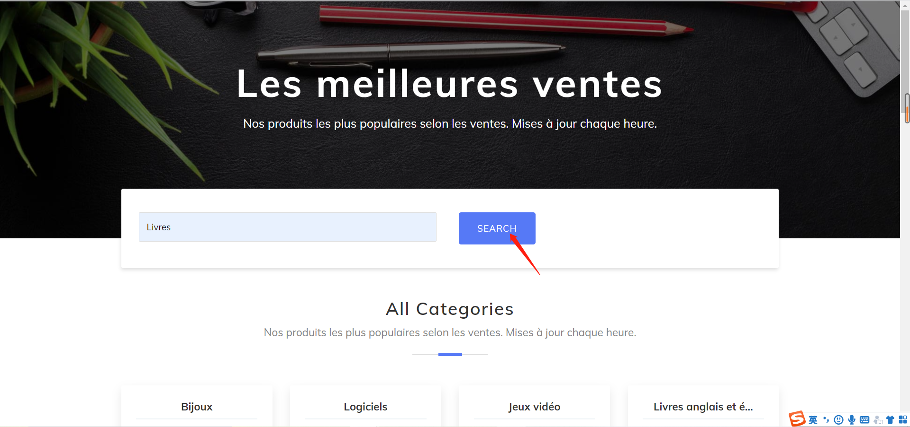
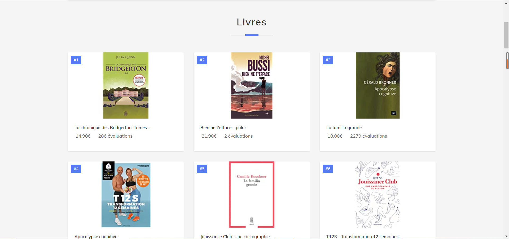

# Projet d'évaluation de l'unité DSIA_4201C Data Engineering 

## Table of Contents

- [Introduction](#introduction)
- [Installer](#installer)
- [Usage](#usage)
- [Structure du projet](#structure-du-projet)
- [Présentation](#présentation)

## Introduction 

Ce projet consiste en la création d'une application avec Flask qui présente les meilleurs ventes du site [Amazon](http://www.amazon.com).

## Installer

Environment et Packages: Pipenv permet de créer un environnment virtuel propre pour votre projet. Toutes les librairies sont listées dans le fichier Pipfile. Le Pipfile.lock référence les versions d'installation de toutes les librairies, un hash est aussi stocké permettant de vérifier la cohérence avec les librairies déclarées et celles installées.

Clonez le git repo avec la commande suivante:

```
git clone https://github.com/DelphineGambier/Projet_DSIA_4201C.git
```

## Usage

Exécutez "flask run" dans le terminal, normalement c'est comme suit après l'exécution.

```
E:\documents\DSIA_4201C - Data engineering\Projet>flask run
 * Environment: development
 * Debug mode: on
 * Restarting with windowsapi reloader
 * Debugger is active!
 * Debugger PIN: 808-186-928
 * Running on http://127.0.0.1:5000/ (Press CTRL+C to quit)

```
Entrez http://127.0.0.1:5000/, puis vous pouvez voir la page d'accueil. Il montre les 3 meilleures ventes de tous les département. Ensuite, vous pouvez cliquer sur «affiche plus» d'un département pour afficher les classements plus détaillés de ce département. Et vous pouvez également rechercher les classements détaillés d'un département via la fonction de recherche.
Les fonctions détaillées sont affichées dans la section de [Présentation](#présentation)(Vous pouvez cliquer ici pour sauter au présentation).

## Structure du projet 

Ce projet est composé de Scrapy, MongoDB et flask.

### Scrapy(scraping temps réel)

Ficher et dossiers: amazonSpider, scrapy.cfg, app.py

amazonSpider
<br/>
Il contient deux spiders et deux pipelines et un middleware.
spider "amazon" est pour crawler les 3 meilleures ventes de tous les département, pipeline "AmazonspiderPipeline" télécharge les données et les images pour spider "amazon".
spider "departement" est pour crawler les 50 meilleures ventes d'un département, pipeline "departPipeline" télécharge les données et les images pour spider "departement".
middleware "MyUserAgentMiddleware" est utilisé pour sélectionner au hasard User-Agent.

scrapy.cfg: dossier de configuration.

app.py: Après le démarrage de flask, lorsque vous visitez la page d'accueil, spider sera exécuté pour obtenir des données et les insérer dans la base de données.


### MongoDB

dossiers: pipelines.py, app.py

pipelines.py: Lorsque le pipeline est initialisé, il se connecte à la base de données via le package pymongo. Chaque fois que le pipeline reçoit 'item' capturé par 'spider', il sera inséré dans la base de données après un processus simple.

app.py: Après avoir démarré flask et exécuté spider, il se connectera à la base de données pour obtenir les données et les afficher sur la page.

### Flask

Ficher et dossiers: static, templates, app.py

static: Il a stocké des dossiers css, et il stockera les images téléchargées.

templates: Les dossiers templates sont stockés dans le ficher templates.

app.py: programme flask(exécution de l'araignée, connexion à la base de données, configuration du template et transmission de données via la fonction render_template, etc.).

## Présentation

Parce qu'il y a trop de données, les images ne sont pas affichées complètement.

la page d'accueil: Il montre les 3 meilleures ventes de tous les département.


&nbsp; 


 &nbsp;  
 &nbsp;
la page de détail: Il montre les 50 meilleures ventes de tous les département.
&nbsp; 

&nbsp; 

&nbsp; 


 &nbsp; 
 &nbsp;
fonction de recherche


&nbsp; 

&nbsp; 

&nbsp; 


