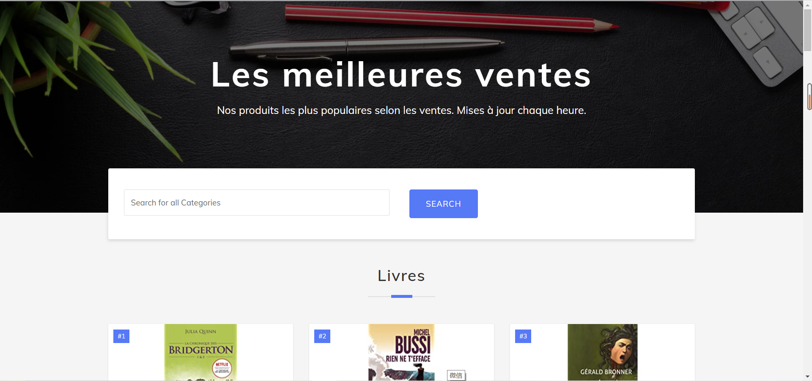

# Projet d'évaluation de l'unité DSIA_4201C Data Engineering 

## Table of Contents

- [Introduction](#introduction)
- [Prérequis](#prérequis )
- [Usage](#usage)
- [Structure du projet](#structure-du-projet)
  * [Scrapy](#scrapy)
  * [MongoDB](#mongodb)
  * [Flask](#flask)
- [Présentation](#présentation)

## Introduction 

Ce projet consiste en la création d'une application en utilisant [Scrapy](https://docs.scrapy.org/en/latest/), [MongoDB](https://docs.mongodb.com/manual/), [Flask](https://flask.palletsprojects.com/en/1.1.x/) qui présente les meilleures ventes du site [Amazon](http://www.amazon.com) par catégorie.

## Prérequis 

Environnement et Packages : Tous les détails sont dans [Pipfile](https://github.com/DelphineGambier/Projet_DSIA_4201C/blob/main/Pipfile) et [Pipfile.lock](https://github.com/DelphineGambier/Projet_DSIA_4201C/blob/main/Pipfile.lock).

Clonez le git répertoire avec la commande suivante :

```
git clone https://github.com/DelphineGambier/Projet_DSIA_4201C.git
```

## Usage

Exécutez "flask run" dans le terminal, cela donne le résultat-ci dessous.

```
E:\documents\DSIA_4201C - Data engineering\Projet>flask run
 * Environment: development
 * Debug mode: on
 * Restarting with windowsapi reloader
 * Debugger is active!
 * Debugger PIN: 808-186-928
 * Running on http://127.0.0.1:5000/ (Press CTRL+C to quit)

```
Entrez http://127.0.0.1:5000/ dans votre navigateur pour voir la page d'accueil.

## Structure du projet 

Ce projet a utilisé différents outils : 
- [Scrapy](https://docs.scrapy.org/en/latest/) 
- [MongoDB](https://docs.mongodb.com/manual/) 
- [Flask](https://flask.palletsprojects.com/en/1.1.x/)

### Scrapy 

Pour notre application, nous avons fais le choix d'utiliser un scraping en temps réel.

Fichers et dossiers : [amazonSpider](https://github.com/DelphineGambier/Projet_DSIA_4201C/tree/main/amazonSpider), [scrapy.cfg](https://github.com/DelphineGambier/Projet_DSIA_4201C/blob/main/scrapy.cfg), [app.py](https://github.com/DelphineGambier/Projet_DSIA_4201C/blob/main/app.py)

- [amazonSpider](https://github.com/DelphineGambier/Projet_DSIA_4201C/tree/main/amazonSpider) : Il contient deux spiders, deux pipelines et un middleware. Spider "amazon" sert à crawler les 3 meilleures ventes de tous les départements, [pipeline](https://github.com/DelphineGambier/Projet_DSIA_4201C/blob/main/amazonSpider/pipelines.py) "AmazonspiderPipeline" télécharge les données et les images pour le spider "amazon".
Le spider "departement" est pour crawler les 50 meilleures ventes d'un département, le pipeline "departPipeline" télécharge les données et les images pour spider "departement". [Middleware](https://github.com/DelphineGambier/Projet_DSIA_4201C/blob/main/amazonSpider/middlewares.py) "MyUserAgentMiddleware" est utilisé pour sélectionner au hasard un User-Agent.

- [scrapy.cfg](https://github.com/DelphineGambier/Projet_DSIA_4201C/blob/main/scrapy.cfg) : Dossier de configuration.

- [app.py](https://github.com/DelphineGambier/Projet_DSIA_4201C/blob/main/app.py) : Après le démarrage de flask, lorsque vous visitez la page d'accueil, spider sera exécuté pour récupérer des données et les insérer dans la base de données.


### MongoDB

Dossiers et fichiers : [pipeline.py](https://github.com/DelphineGambier/Projet_DSIA_4201C/blob/main/amazonSpider/pipelines.py), [app.py](https://github.com/DelphineGambier/Projet_DSIA_4201C/blob/main/app.py)

- [pipeline.py](https://github.com/DelphineGambier/Projet_DSIA_4201C/blob/main/amazonSpider/pipelines.py): Lorsque le pipeline est initialisé, il se connecte à la base de données via le package pymongo. Chaque fois que le pipeline reçoit un 'item' capturé par 'spider', il sera inséré dans la base de données après un processus simple.

- [app.py](https://github.com/DelphineGambier/Projet_DSIA_4201C/blob/main/app.py) : Après avoir démarré flask et exécuté spider, il se connecte à la base de données pour obtenir les données et les afficher sur la page.

### Flask

Fichers et dossiers : [static](https://github.com/DelphineGambier/Projet_DSIA_4201C/tree/main/static), [templates](https://github.com/DelphineGambier/Projet_DSIA_4201C/tree/main/templates), [app.py](https://github.com/DelphineGambier/Projet_DSIA_4201C/blob/main/app.py)

- [static](https://github.com/DelphineGambier/Projet_DSIA_4201C/tree/main/static) : Il stocke des dossiers css, et les images téléchargées.

- [templates](https://github.com/DelphineGambier/Projet_DSIA_4201C/tree/main/templates) : Il stocke les modèles qui seront affichés.

- [app.py](https://github.com/DelphineGambier/Projet_DSIA_4201C/blob/main/app.py) : Programme flask qui procède à l'exécution de spider, la connexion à la base de données, la configuration du template et la transmission de données via la fonction render_template.

## Présentation

Voici un aperçu du résultat obtenu.

### La page d'accueil 
La page d'accueil montre les 3 meilleures ventes de chaque département.


&nbsp; 


 &nbsp;  
 &nbsp;
### La page de détail
La page de détail montre les 50 meilleures ventes du département lorque que l'on clique sur "Affiche plus".
&nbsp; 

&nbsp; 

&nbsp; 


 &nbsp; 
 &nbsp;
### La fonction de recherche
La fonction de recherche permet de rechercher plus précisément un produit grâce à une barre de recherche.


&nbsp; 

&nbsp; 

&nbsp; 


